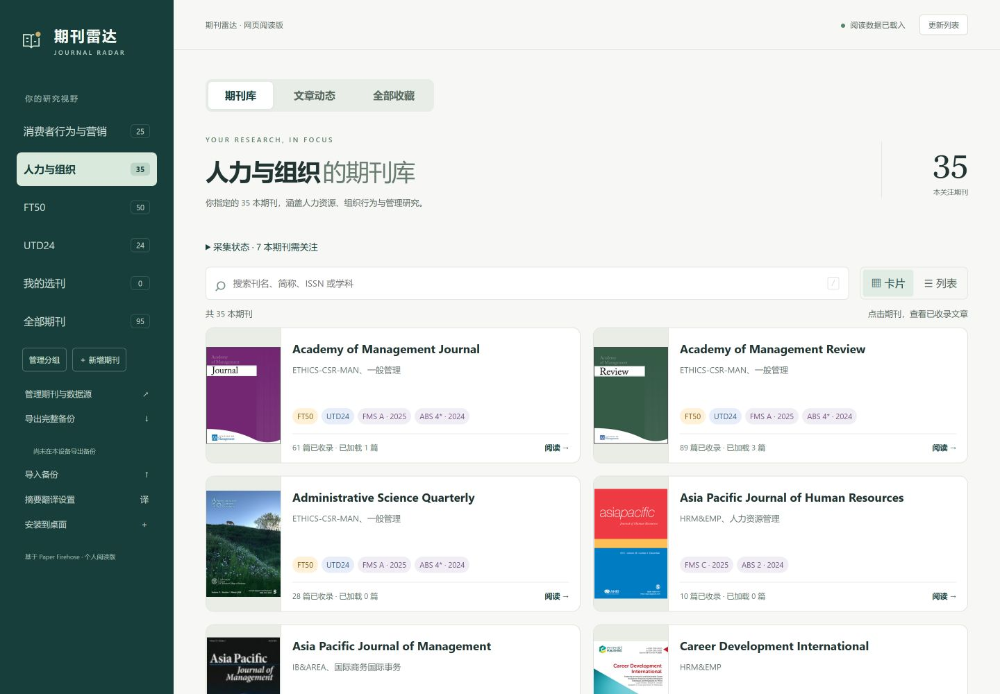
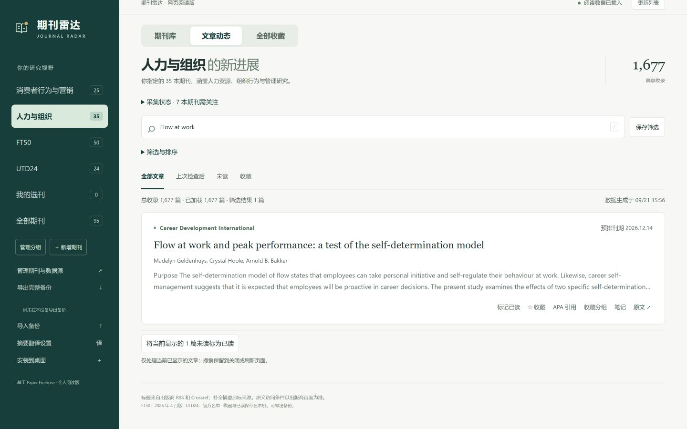
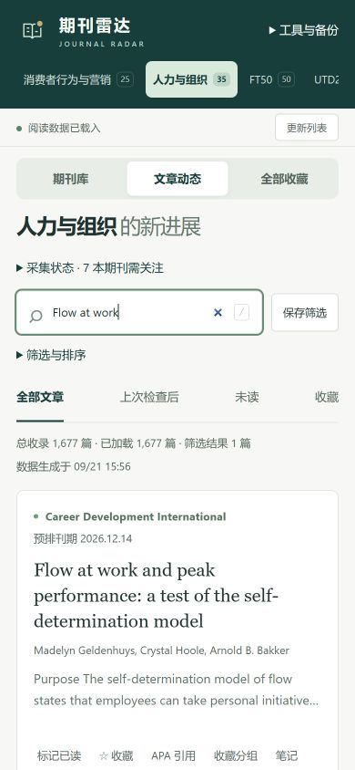
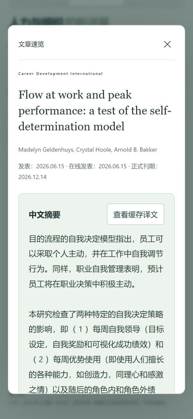
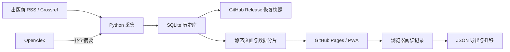

<p align="center">
  
</p>

<h1 align="center">期刊雷达 · Journal Radar</h1>

<p align="center">
  <strong>关注期刊的新进展，留住值得细读的研究。</strong><br>
  面向个人研究者的学术期刊追踪与阅读工具，支持中文摘要、阅读管理和引用导出。
</p>

<p align="center">
  <a href="https://github.com/linkingoscar/journal-radar/actions/workflows/journal-radar.yml"></a>
  <a href="LICENSE"></a>
  <a href="docs/development.md"></a>
  <a href="https://linkingoscar.github.io/journal-radar/"></a>
</p>

<p align="center">
  <a href="https://linkingoscar.github.io/journal-radar/"><strong>在线体验 ↗</strong></a> ·
  <a href="#快速开始">快速开始</a> ·
  <a href="docs/user-guide.md">使用指南</a> ·
  <a href="docs/development.md">开发与部署</a> ·
  <a href="CONTRIBUTING.md">参与贡献</a>
</p>



<p align="center"><sub>当前产品实拍 · 2026-09-21 · 页面数量和来源状态随采集更新。</sub></p>

## 为什么做这个工具

研究选题常常从“最近有哪些值得读的新文章”开始。期刊雷达把关注期刊的更新汇集到一个阅读页面，让你按自己的节奏检索、读摘要、做笔记，再把需要的文献导出到后续写作流程。

项目基于 [Paper Firehose](https://github.com/zrbyte/paper-firehose) 二次开发：Python 负责采集与数据整理，原生 JavaScript 提供阅读界面，GitHub Actions 与 Pages 承担自动更新和静态发布。直接使用在线版无需注册账号。

## 能做什么

| 场景                 | 提供的能力                                                                     |
| -------------------- | ------------------------------------------------------------------------------ |
| **追踪新文**         | 按最新收录或发表时间浏览，用“上次检查后”接着上次的进度读                       |
| **找到相关研究**     | 搜索标题、作者、摘要、DOI 和笔记；组合期刊、时间、标签与阅读状态，保存常用筛选 |
| **读懂与记录**       | 中英文摘要对照、上一篇 / 下一篇、笔记与标签、收藏分组、批量已读与撤销          |
| **衔接文献写作**     | APA 7 参考文献与正文引用，可核对和编辑书目信息，导出 RIS、BibTeX、TXT 或 HTML  |
| **带着资料离线读**   | 缓存已加载的页面与数据，支持 PWA；通过 JSON 备份迁移阅读记录与个人配置         |
| **扩展自己的期刊库** | Windows 本机版可新增期刊或 RSS、查询往期目录、补采摘要，并管理期刊封面         |

<details>
<summary><strong>查看桌面文章检索界面</strong></summary>



</details>

### 小屏幕也能专注阅读

<table>
  <tr>
    <th align="center">检索与追刊</th>
    <th align="center">摘要速览与中文翻译</th>
  </tr>
  <tr>
    <td align="center"></td>
    <td align="center"></td>
  </tr>
</table>

截图展示公开文章；中文摘要为机器翻译，阅读时可对照英文原文。

## 快速开始

### 直接在线阅读

打开 **[期刊雷达](https://linkingoscar.github.io/journal-radar/)**，选择期刊分组即可开始。支持桌面与手机浏览器，也可通过浏览器的“安装应用”入口作为 PWA 使用。

建议先浏览「文章动态」，将感兴趣的文章加入收藏；下次使用「上次检查后」追踪新收录内容。页面上的「更新列表」读取云端结果，云端计划在北京时间 **09:23、21:23** 采集，实际运行可能延迟。

### 安装 Windows 本机增强版

需要 **Python 3.10+、PowerShell 7、Microsoft Edge**；下面的克隆命令还需要 Git。在 PowerShell 中执行：

```powershell
git clone https://github.com/linkingoscar/journal-radar.git
cd journal-radar
pwsh -NoProfile -File .\Install-DesktopShortcut.ps1
```

安装完成后双击桌面的「期刊雷达」图标。安装脚本会建立独立 Python 环境；日常使用时，启动器在后台运行本机组件并用 Edge 独立窗口打开页面。本机服务地址为 `http://127.0.0.1:8766/`，仅监听回环地址。

| 能力                                 | 在线版 / PWA | Windows 本机增强版 |
| ------------------------------------ | :----------: | :----------------: |
| 云端文章、摘要翻译、收藏、笔记与引用 |      ✓       |         ✓          |
| 缓存已加载内容供离线阅读             |      ✓       |         ✓          |
| 阅读记录导出 / 导入                  |      ✓       |         ✓          |
| 本机补采、逐篇补取摘要               |      —       |         ✓          |
| 按年份查询往期期刊目录               |      —       |         ✓          |
| 新增采集期刊 / RSS、上传封面         |      —       |         ✓          |

**在线版和本机版的阅读记录分别保存在各自浏览器站点中。** 首次切换可用「迁移网页版内容」，也可使用「导出完整备份 / 导入备份」。详细步骤见[使用指南](docs/user-guide.md)。

## 内置期刊范围

当前配置去重后共 **95 本期刊**，不同清单可以重叠：

| 清单             | 数量 | 说明                         |
| ---------------- | ---: | ---------------------------- |
| 人力与组织       |   35 | 人力资源、组织行为与管理研究 |
| FT50             |   50 | 配置采用 2026 年 4 月版名单  |
| UTD24            |   24 | 商学院研究期刊清单           |
| 消费者行为与营销 |   25 | 消费者研究、营销及相关方向   |

清单、ISSN 和采集源以 [`radar/journals.json`](radar/journals.json) 为准；名单依据见[期刊来源说明](radar/CATALOG_SOURCES.md)与[营销期刊核验](docs/consumer-marketing-journals.md)。本机版可添加自己的期刊，个人分组支持一本期刊加入多个组。

## 数据如何流动



Windows 本机版另有独立数据库，用于合并云端数据、本机补采与历史目录查询；它不会把个人数据库自动上传到 GitHub。

- **阅读数据属于本机。** 已读、收藏、笔记和译文保存在当前浏览器；清除站点数据或换设备前请导出备份。目前不提供账号式跨设备自动同步。
- **译文按需生成。** 默认翻译服务为 MyMemory，翻译时会发送文章摘要，已有译文在本机缓存；可在设置中关闭自动翻译。
- **来源覆盖有边界。** Crossref、RSS 和 OpenAlex 可能延迟、缺少摘要或暂时不可用；页面提供来源状态。收录期刊不等于逐篇完整覆盖，也不提供付费全文访问。
- **引用可以核对。** 来源不完整时会提示待核对，支持手动修正；机器翻译和引用结果仍需对照原文。

恢复方法与备份范围见[数据恢复说明](docs/data-recovery.md)。

## 本地开发与部署

前端使用原生 HTML / CSS / JavaScript，阅读应用的 Python 依赖位于 `radar/`；根目录的 Python 包配置保留给上游 CLI。Node.js 24 用于前端格式检查与测试。

```text
journal-radar/
├── radar/                 # 采集、本机服务、测试与期刊配置
│   └── web/               # 阅读界面、离线缓存、翻译与引用
├── src/paper_firehose/    # 复用并保留的上游 Python 核心
├── docs/                 # 使用、开发、恢复说明与截图
├── state/snapshot.json   # 已验证的云端恢复快照指针
└── .github/workflows/    # 自动采集、检查与 Pages 发布
```

- [本地运行与开发检查](docs/development.md#本地运行)：安装轻量依赖、恢复历史快照、构建并预览页面。
- [部署自己的实例](docs/development.md#部署自己的实例)：Fork、初始化自己的 Release 快照、配置 Pages 和采集工作流。
- [参与贡献](CONTRIBUTING.md)：报告问题、补充期刊来源、改进界面或提交修复。

## 文档导航

| 文档                                      | 内容                                             |
| ----------------------------------------- | ------------------------------------------------ |
| [使用指南](docs/user-guide.md)            | 阅读流程、筛选、摘要、目录、收藏与引用的具体行为 |
| [开发与部署](docs/development.md)         | 环境准备、命令、Fork 初始化、项目维护            |
| [数据恢复](docs/data-recovery.md)         | 云端快照、个人备份、迁移与恢复                   |
| [第三方引用组件](docs/citation-vendor.md) | citeproc-js、APA CSL 的版本、来源与许可          |
| [上游项目文档](README.upstream.md)        | Paper Firehose 原始 CLI 与功能说明               |

## 致谢与许可

本项目基于 [Paper Firehose](https://github.com/zrbyte/paper-firehose) v0.4.2 开发，保留上游提交历史与版权声明，复用其 SQLite 历史库、检索索引、DOI 提取和文本处理能力。感谢 Crossref、OpenAlex、出版商 RSS 及 MyMemory 提供的数据与服务。

项目代码沿用 [MIT License](LICENSE)。随附的 **citeproc-js 使用 CPAL 1.0**，APA CSL 样式与语言文件使用 **CC BY-SA 3.0**；第三方组件遵循各自许可，详见[组件说明](docs/citation-vendor.md)。期刊封面及文章内容的权利归相应权利人所有。
